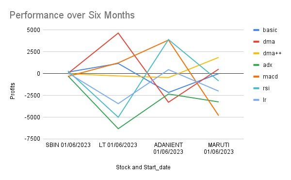
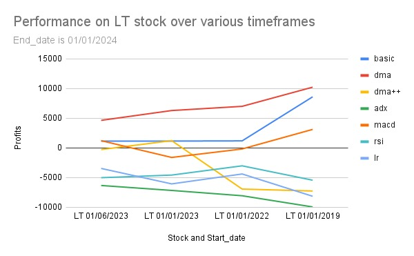

Name: Vraj Parikh   Entry No.: 2022CS11084

Name: Akshad Mhaske Entry No.: 2022CS11611

# Overview:

-   Various trading strategies for the algorithmic buying and selling of
    stocks were implemented and tested on varied data.

-   Data for testing and training the strategies was obtained using the
    jugaad-data Python library, thus necessary data was first obtained
    by running the python files and then the cpp files of respective
    strategies were run.

-   Suitable optimisations were performed to make the processes faster
    and also to ensure correctness of the code.

-   Obtained data of various strategies was plotted to compare the
    strategies over different timeframes and stock choices.

# Optimizations:

1.  **BASIC:** 
-   Instead of checking data for past 'n' days to check for
    monotonicity, a counter was established to keep count of the stock
    price trend. If stock prices followed the monotonicity, counter was
    incremented, else the counter was set back to 1. The counter was
    checked to be greater or equal to 'n' to make order decisions for
    that date.

2.  **DMA:**

-   The mean for past 'n' days was calculated using a 'rolling window'
    method, i.e., present day's price divided by 'n' was added and that
    for the previous nth day was subtracted to obtain the new mean,
    instead of calculating mean for 'n' days every time.

-   A mean of square of prices was also obtained using the same 'rolling
    window' method. The standard deviation was thus calculated using
    these, instead of again analysing data for past 'n' days.

3.  **DMA++**:

-   The denominator for ER was calculated using the 'rolling window'
    method, adding the latest absolute price change and subtracting
    the one for 'n' days prior.

-   The recursive variables were calculated by just performing the
    operations on the values obtained in the previous iteration.

-   The positions were stored as a queue (implemented using a vector).
    This allowed easy checking of the oldest position, as well as
    addition of a new position.

4.  **MACD**:

-   The dates were converted from the dd/mm/yyyy format to yyyy/mm/dd
    format. This was done so that to check if one date happens to be
    earlier than the other we just have to compare them
    lexicographically.

5.  **RSI**:

-   It may happen that the average loss within a lookback period of n
    days on a particular trading day comes out to be 0. In this case the
    RS value would become undefined but assuming that it is infinity if
    we put in the value of RS to be infinty in the formula for RSI we
    get that RSI equals 100. So we have added a few if-else \'s to check
    if avg. loss becomes 0 and rather than showing a divide by zero
    error, we correctly computed the value of RSI to be 100.

-   Also similar to other strategies, average gain and loss was
    calculated by the sliding window technique which betters
    our time complexity.

6.  **Linear Regression:**

-   **The calculation of the beta coefficients was done in linear time
    complexity, i.e., in O(n)**, where n is the size of the data, as
    opposed to the general O(n3) method involving matrix operations on
    the data matrix.

-   This was done by first obtaining 8 linear equations in 8 variables
    (betas) through manual calculation. In this the square error
    (Σ(y-yi)2) was minimised by differentiating it with each beta
    and then equalling it to zero (taking the derivative as 0). Thus
    taking 8 partial derivatives (one w.r.t to each beta) and equating
    them to 0 formed 8 linear equations.

-   The coefficients of the variables (betas) were of the form Σxi ,
    Σxi2 , Σxixj and Σxiy , which were obtained from the data
    in linear time (xi are the data points for a particular parameter,
    y is the Close price).

-   The system of equations was then solved using Gauss-Jordan method in
    O(83) or O(1) constant time.

7.  **Best of All:**

-   Parallel threading was done using the OpenMP library in C++, where
    various functions of the strategies were run parallelly.

-   The different data generation for the different strategies in Python
    also used threading to make the data files parallelly. For this the
    threading library of Python was used.

8.  **Pairs**:

-   The rolling mean and rolling standard deviation have been calculated
    using the same sliding window technique discussed above. We have
    ensured that we store the sum of values or sum of squares of values
    rather than the actual mean or standard deviation to maintain
    precision of the values.

# Observations:

The different strategies were tested on diverse data.

The data was varied on two parameters:

1.  Timeframe

2.  Stock choice

Obtained results were plotted on the below graphs:

1.  **Time-based comparisons:**

{width="4.065970034995625in"
height="2.5141251093613297in"}{width="4.024011373578302in"
height="2.488180227471566in"}{width="3.8926552930883638in"
height="2.4069586614173226in"}

2.  **Performance for stock choice:**

{width="3.7796609798775154in"
height="2.3370898950131234in"}{width="3.8375448381452317in"
height="2.37288167104112in"}{width="3.810132327209099in"
height="2.3559317585301836in"}{width="3.85581583552056in"
height="2.3841797900262467in"}

3.  **Overall performance:**

{width="6.268055555555556in"
height="3.8805555555555555in"}

Observations made:

-   Simple strategies like BASIC, DMA and DMA++ outperformed other
    complex strategies in consistency of profits.

-   MACD strategy was a clear outperformer everywhere except in the
    six-month timeframe.

-   ADX strategy consistently underperformed in every aspect, recording
    losses almost everywhere.

-   Though the performance of the strategies over one particular stock
    were not clearly definable, LT stock clearly differentiated between
    strategies, with DMA claiming highest profits and ADX the least for
    all timeframes.
